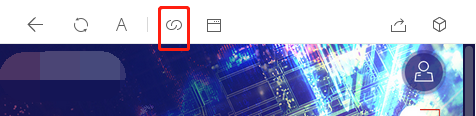

### Chrome抓包微信授权界面
#### 原因
---
> 正常用微信浏览器打开时，但是没法进行调试

> 当用chrome打开时，微信会跳转到强制授权界面

每次调试微信的授权网页时总是痛不欲生，偏偏又时不时碰到需要去查看~~别人~~源码的需求
这次又碰到了，特意查找配置并记录一下

#### 准备
---
    工具：
        fiddler
        chrome
        wechat

#### 实现
---
    01 打开fiddler抓包

    02 在微信端打开链接

    
     03 抓取微信授权信息
> 在fiddler中我们可以看到这些信息
> 
> 
> 
> user-Agent是我们需要使用到的部分，将其整行复制下来

    04 在chrome中打开需要调试的链接
> 会出现以下情况，这是因为没授权的原因导致的

> F12打开调试窗口 > ...> More tools > Network conditions 

> 如图操作 > 取消勾选 > 填入03复制到*user-Agent*

    05 获取微信真实链接，开始调试
> 接04配置好之后刷新页面出来的是空白，这是因为未跳转到项目真实的链接
> 查看fiddler，直接对第一条链接右键 > copy > just url
> 
>
> 粘贴在chrome中就可以直接调试我们需要的页面了

#### 后续
---
打开页面之后很开心的发现是用vue写的，~~而我不会,只能~~看逻辑

#### 参考引用
---
> [馨语随风：Chrome获取微信授权，调试公众号页面](https://www.cnblogs.com/tracyjfly/p/10179023.html)
 